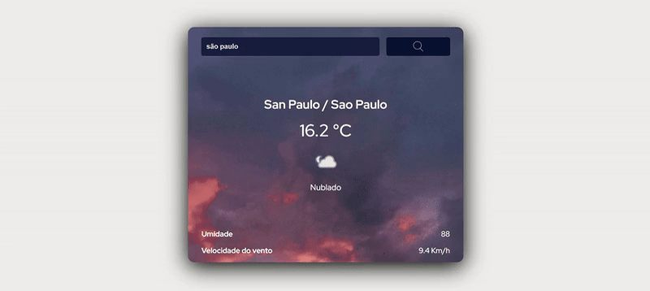
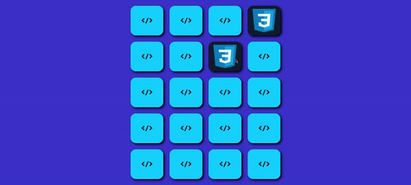
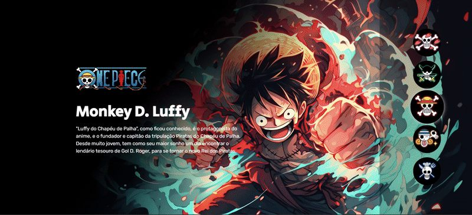
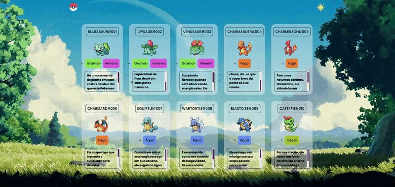

<div align="center">


# Victor de Souza — Desenvolvedor Frontend

**Não gosto de ideia parada no papel. Minha parte é fazer ela virar software.**

### [🔗 portfolio-victorbueno.netlify.app](https://portfolio-victorbueno.netlify.app/)

[](https://react.dev)
[](https://tailwindcss.com)
[](https://developer.mozilla.org/pt-BR/docs/Web/JavaScript)
[](https://developer.mozilla.org/pt-BR/docs/Web/HTML)
[](https://developer.mozilla.org/pt-BR/docs/Web/CSS)

</div>

## Sobre

Este é o código-fonte do meu portfólio pessoal. Construí ele para contar uma história real: saí de Operador de Risco para desenvolvedor frontend, hoje atuando na **Noweb Publicidade**, e queria um site que mostrasse isso sem parecer um currículo em PDF disfarçado de página web.

O site é pensado pra quem tem 30 a 60 segundos pra decidir se continua lendo — normalmente um recrutador sem formação técnica. Por isso a home é um resumo de tudo, e cada assunto (projetos, habilidades, experiência, sobre mim) ganha a própria aba, com profundidade pra quem quiser ir além.

## Destaques técnicos

Nada de bibliotecas pesadas pra resolver o que dá pra fazer com o navegador. Alguns pontos que valem a leitura do código:

- **Carrossel de projetos sem biblioteca** — scroll-snap nativo, com setas, indicadores, navegação por teclado e ARIA.
- **Cor de tecnologia é sempre um ponto, nunca cor de texto.** O amarelo do JavaScript (`#F0DB4F`) dá 1,4:1 de contraste sobre branco — ilegível como texto. Resolvido virando um selo colorido ao lado do nome, com o texto sempre em neutro escuro.
- **Prévias de projeto sob demanda** — os GIFs animados (32 MB ao todo) só são baixados quando o card entra na viewport, e descartados quando sai. Ninguém baixa os quatro ao mesmo tempo só de abrir a página.
- **Splash de abertura com prefetch em segundo plano** — enquanto a Laila (minha cachorra) corre na tela, o site já busca em cache o que as outras abas vão precisar.
- **Zero dependências além do essencial** — React, React Router e Tailwind. O resto (carrossel, animações, ícones das tecnologias) é feito à mão.
- Acessibilidade levada a sério: navegação por teclado, `prefers-reduced-motion` respeitado em toda animação, alvo de toque mínimo de 44×44px, `skip-link` pro conteúdo.

## Tecnologias

- [React](https://react.dev) 18 + [React Router](https://reactrouter.com) 6
- [Tailwind CSS](https://tailwindcss.com) 3
- [Create React App](https://create-react-app.dev) como base de build

## Projetos em destaque

| Projeto | O que é | Código | Ao vivo |
|---|---|---|---|
| **Ventus** | Previsão do tempo de qualquer cidade do mundo, com dados reais de uma API de meteorologia | [repo](https://github.com/BuenosVictor/App-Clima) | [ver funcionando](https://app-clima-victor.netlify.app/) |
| **Code Pairs** | Jogo da memória com cartas de tecnologias — nasceu pra treinar lógica, minha maior fragilidade no início | [repo](https://github.com/BuenosVictor/Jogo-da-Memoria) | [ver funcionando](https://jogo-da-memoria-victor.netlify.app/) |
| **One Piece** | Página interativa sobre os personagens do anime, com transições animadas | [repo](https://github.com/BuenosVictor/One-Piece) | [ver funcionando](https://one-piece-layout.netlify.app/) |
| **Pokedex** | Catálogo visual dos primeiros Pokémon, meu primeiro projeto de verdade | [repo](https://github.com/BuenosVictor/Pokedex) | [ver funcionando](https://victor-pokedex.netlify.app/) |

<div align="center">




</div>

## Rodando localmente

```bash
git clone https://github.com/BuenosVictor/Portifolio.git
cd Portifolio
npm install
npm start
```

Abre em [http://localhost:3000](http://localhost:3000).

Outros comandos disponíveis:

```bash
npm run build   # build de produção em /build
npm test        # testes (Jest, via react-scripts)
```

## Estrutura do projeto

```
src/
├── data/                  # conteúdo do site: perfil, projetos, habilidades
├── ui/                    # componentes reutilizáveis (Button, Carousel, Logo...)
├── *-component/           # uma pasta por seção/página (Hero, Footer, ProjectsPage...)
└── assets/                # ícones, screenshots e fotos
```

## Contato

- **E-mail:** [buenos.victor2004@gmail.com](mailto:buenos.victor2004@gmail.com)
- **LinkedIn:** [linkedin.com/in/victor-bueno-382054262](https://www.linkedin.com/in/victor-bueno-382054262/)
- **GitHub:** [github.com/BuenosVictor](https://github.com/BuenosVictor)

---

<div align="center">
Feito com React e Tailwind por Victor de Souza.
</div>
